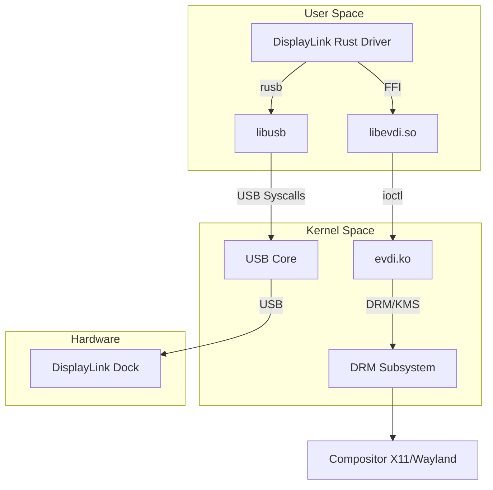

# STARDRIVE Project Context

## Project Overview

**STARDRIVE** is an open-source, reverse-engineered **DisplayLink USB driver** written in **Rust**. It allows using DisplayLink-based USB docks (specifically targeting the StarTech USB35DOCK, VID: `0x17e9`, PID: `0x4307`) on Linux systems.

The project works by implementing a user-space driver that communicates with the USB hardware and bridges it to the Linux DRM/KMS subsystem using the **EVDI (Extensible Virtual Display Interface)** kernel module.

### Key Components

1.  **DisplayLink Driver (`displaylink-driver/`)**: The core user-space application written in Rust.
    *   Handles USB communication (control & bulk transfers).
    *   Implements the proprietary DisplayLink protocol (reverse-engineered).
    *   Performs pixel processing (BGRA -> RGB565) and RLE compression.
    *   Manages the virtual display via EVDI.
2.  **EVDI (`evdi_source/`)**: A kernel module and library platform allowing the creation of virtual monitors.
    *   `evdi_source/module`: The Linux kernel module (`evdi.ko`).
    *   `evdi_source/library`: The C library (`libevdi.so`) wrapping ioctl calls to the module.
3.  **Scripts**:
    *   `build.sh`: Orchestrates the build of all components.
    *   `install.sh`: Handles system-wide installation (binaries, udev rules, systemd).

## Architecture



## Development Status

**Current Status:** ✅ **Phase 6 Complete** (Advanced Features)

*   **Supported:** USB device discovery, EVDI integration, Protocol implementation (Control/Bulk/RLE), Multi-monitor support, Hot-plug detection, Dynamic resolution switching, DPMS power management.
*   **Target Hardware:** StarTech USB35DOCK (VID: `0x17e9`, PID: `0x4307`).

## Build & Installation

### Prerequisites
*   Linux Kernel 5.0+ (Headers required)
*   Rust (stable)
*   `libdrm-dev`, `libusb-1.0-0-dev`, `clang` (for bindgen)

### Build Commands
The project uses a unified build script:

```bash
# Build everything (EVDI lib, EVDI module, Rust driver)
./build.sh

# Build only the Rust driver (useful for iteration if EVDI is installed)
./build.sh --skip-library --skip-module
```

### Run Commands
**Development (Manual):**
```bash
cd displaylink-driver
# Run with logging enabled
RUST_LOG=debug cargo run --release
```

**Production (Systemd):**
```bash
sudo systemctl start displaylink-driver
```

### Test Commands
```bash
cd displaylink-driver
# Run unit and integration tests
cargo test --release
```

## Directory Structure

*   `displaylink-driver/`: Rust source code.
    *   `src/main.rs`: Entry point, device manager.
    *   `src/displaylink_protocol.rs`: Protocol implementation (commands, compression).
    *   `src/network_adapter.rs`: CDC NCM network support.
*   `evdi_source/`: Submodule containing EVDI source code.
*   `docs/`: Hardware datasheets and manuals.
*   `reference/`: Reference official drivers and logs.

## Coding Conventions

*   **Language:** Rust (2021 edition).
*   **Style:** Standard `rustfmt` conventions.
*   **Error Handling:** Uses `anyhow` or `Result` types.
*   **Logging:** Uses `env_logger` / `log` crates.
*   **Safety:** Uses `unsafe` blocks primarily for FFI interactions with `libevdi` and raw buffer manipulation for performance.

## Important Notes for Agents
*   **EVDI Dependency:** The Rust driver **cannot** run without the `evdi` kernel module loaded (`sudo modprobe evdi`).
*   **Permissions:** Accessing USB devices requires root or proper `udev` rules. The `install.sh` script sets up `99-displaylink.rules`.
*   **Protocol:** The DisplayLink protocol is proprietary. This implementation is based on reverse engineering. Refer to `PROTOCOL.md` for details on the command structure if modifying the protocol logic.
